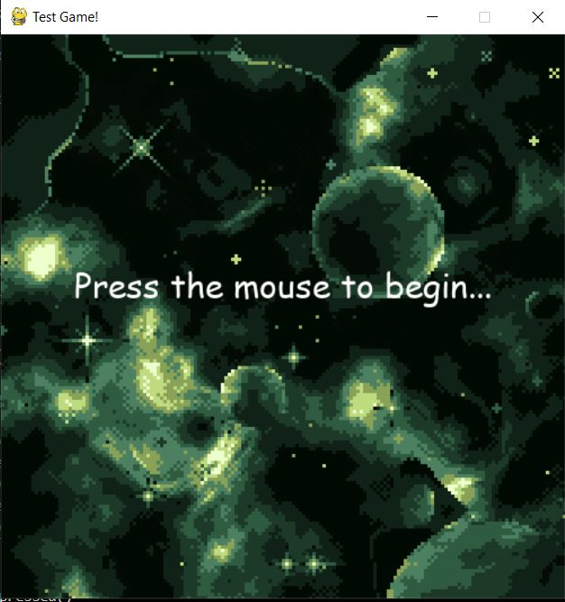
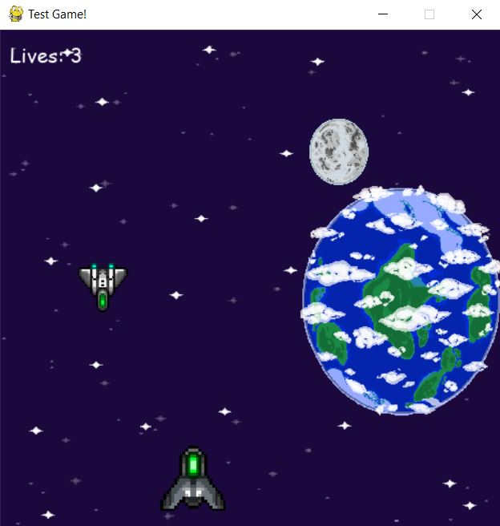

# PRIMER JUEGO EN [PYGAME](https://www.pygame.org/news)

## MAIN

Es un juego simple tipo shoot'em-up con una nave que va eliminando enemigos que aparecen al azar. Usando la barra espaciadora el jugador puede disparar y destruir las naves que se acercan. Si las naves chocan contra el jugador o el jugador no las destruye antes de que las naves enemigas salgan de la pantalla, el jugador pierde una vida.
Si el jugador pierde todas las vidas, el juego se reinicia.

### Desarrollo

Por motivos personales no pude completar todo lo que queria de este juego. Me parece que necesita algunos detalles para que pueda ser mas atrapante, como aumento de velocidad de enemigos y aumentar la cantidad de enemigos en la pantalla.
Aun así, este fue mi primer juego creado usando [PYGAME](https://www.pygame.org/news), no tenia muchos conocimientos de sus metodos y funciones. por lo que me costó un poco al principio.

#### Sintesis

Entiendo y mucho de programación orientada a objetos, entiendo la mayoria de los metodos, clases y funciones predeterminadas que trae [PYGAME](https://www.pygame.org/news). Me gustaría capacitarme más y recibir algun tipo de guía para poder alcanzar un nivel mas avanzado. Mi nivel es lo suficientemente bueno para enseñar a programar juegos a niños y/o adolescentes que recien estan empezando a programar.
Estoy dispuesto a aprender y a seguir mejorando.